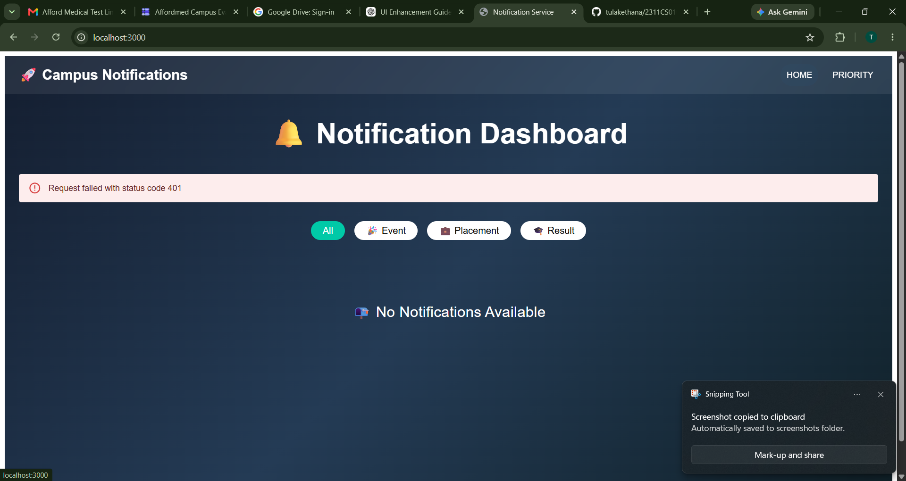
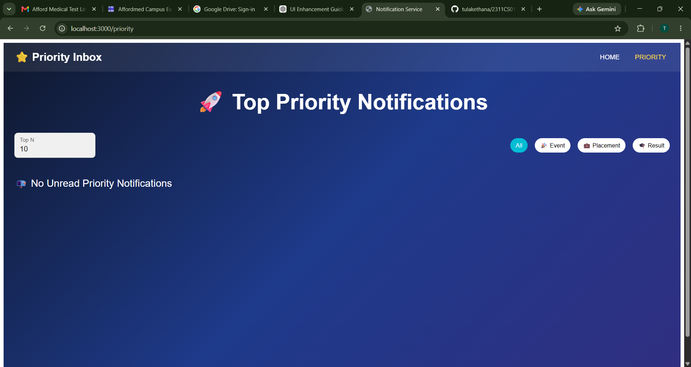

# 🚀 Campus Notification Management System

A modern notification management system that provides real-time campus notifications along with a smart priority inbox. The application is built using **React**, **Material UI**, **Node.js**, and **Express**, enabling users to efficiently manage important notifications.

---

# ✨ Features

### 📢 Notification Dashboard
- View all campus notifications in a clean interface.
- Notifications are grouped into:
  - 🎉 Event
  - 💼 Placement
  - 🎓 Result
- Filter notifications by category.
- Automatic refresh every 10 seconds.
- Read/Unread notification status.

### ⭐ Smart Priority Inbox
- Displays only the highest-priority unread notifications.
- User can choose how many top notifications to display.
- Notifications automatically disappear from the priority list once marked as read.

### ⚡ Priority Calculation
Each notification is assigned a priority score using:

| Notification Type | Weight |
|-------------------|---------|
| 💼 Placement | **3** |
| 🎓 Result | **2** |
| 🎉 Event | **1** |

The final priority considers:
- Notification type
- Notification timestamp (most recent notifications receive higher priority)

---

# 🏗 Project Structure

```
Campus-Evaluation/
│
├── notification-app-fe/
│   ├── src/
│   ├── public/
│   └── package.json
│
├── notification-app-be/
│   ├── routes/
│   ├── services/
│   └── package.json
│
└── README.md
```

---

# 🧠 Data Structure Used

The Priority Inbox is implemented using a **Min-Heap Priority Queue**.

### Advantages

- Efficient insertion
- Fast removal of low-priority notifications
- Maintains only the Top N notifications

### Time Complexity

| Operation | Complexity |
|-----------|------------|
| Insert | O(log N) |
| Remove | O(log N) |
| Get Top Notifications | O(N log N) |

---

# 🎨 User Interface

The application features a modern Material UI design with:

- 🌈 Responsive Layout
- 📱 Mobile Friendly
- 🔥 Glassmorphism Notification Cards
- 🌙 Dark Dashboard Theme
- ⭐ Animated Hover Effects
- 🎯 Color-coded Notification Types

---

# 📸 Screenshots

## 🏠 Notification Dashboard



---

## ⭐ Priority Inbox



---

# 🛠 Technologies Used

### Frontend
- React.js
- Vite
- Material UI
- React Router
- Axios

### Backend
- Node.js
- Express.js

### Utilities
- Priority Queue (Min Heap)
- Local Storage
- REST APIs

---

# ⚙ Installation

## Clone Repository

```bash
git clone <repository-url>
```

---

## Frontend

```bash
cd notification-app-fe
npm install
npm run dev
```

Frontend runs on:

```
http://localhost:5173
```

---

## Backend

```bash
cd notification-app-be
npm install
npm start
```

Backend runs on:

```
http://localhost:3000
```

---

# 🔄 Application Workflow

1. Backend generates notification data.
2. Frontend fetches notifications every 10 seconds.
3. Notifications are filtered by category.
4. Priority Queue computes the highest-priority unread notifications.
5. Users can mark notifications as read.
6. Read notifications are removed from the Priority Inbox.

---

# 🌟 Highlights

- ✅ Real-time notification updates
- ✅ Smart Priority Inbox
- ✅ Efficient Min-Heap implementation
- ✅ Responsive UI
- ✅ Category Filters
- ✅ Read/Unread Tracking
- ✅ REST API Integration

---

# 👨‍💻 Developed For

Campus Evaluation – Frontend Development Assessment

This project demonstrates proficiency in:

- React.js
- REST API Integration
- Data Structures (Priority Queue)
- Modern UI Design
- Component-Based Architecture
- State Management
- Responsive Web Development
